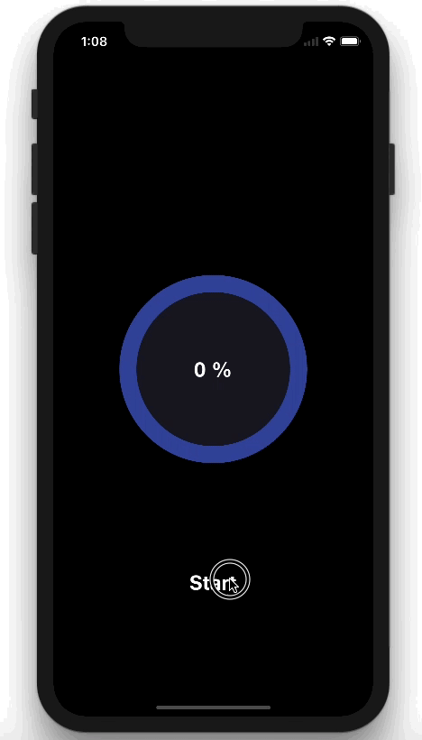

# VVCircleProgressBar
[](https://swift.org)
[](https://twitter.com/vinothvino42)

Custom animating circle progress bar.

## Preview



## Usage
### Instantiation

```VVCircleProgressBar``` can be instantiated programmatically.

```swift
let progressBar = VVCircleProgressBar()
progressBar.center = self.view.center
self.view.addSubview(progressBar)
```

## Customize

You can customize the progress bar color, text font and text color

### Progress Text

```swift
progressBar.textColor = UIColor.white
progressBar.font = UIFont(name: "HelveticaNeue-Bold", size: 24)!
```

### Progress Bar Color

```swift
progressBar.pulsingColor = UIColor.pulsatingFillColor
progressBar.progressColor = UIColor.outlineStrokeColor
progressBar.trackingStrokeColor = UIColor.trackStrokeColor
progressBar.trackingFillColor = UIColor.backgroundColor
```

### Size of Progress Bar

```swift
progressBar.progressLayerWidth = 20
progressBar.trackLayerWidth = 20
progressBar.pulseLayerWidth = 1.3
```

## Start pulsing animation

```swift
progressBar.startPulsingAnimation()
```

## Stop pulsing animation

```swift
progressBar.stopPulsingAnimation()
```

## License

VVCircleProgressBar is available under MIT license. See the [LICENSE](https://github.com/vinothvino42/VVCircleProgressBar/blob/master/LICENSE) file for more info.

## Author

* [Vinoth Vino](https://twitter.com/vinothvino42)

